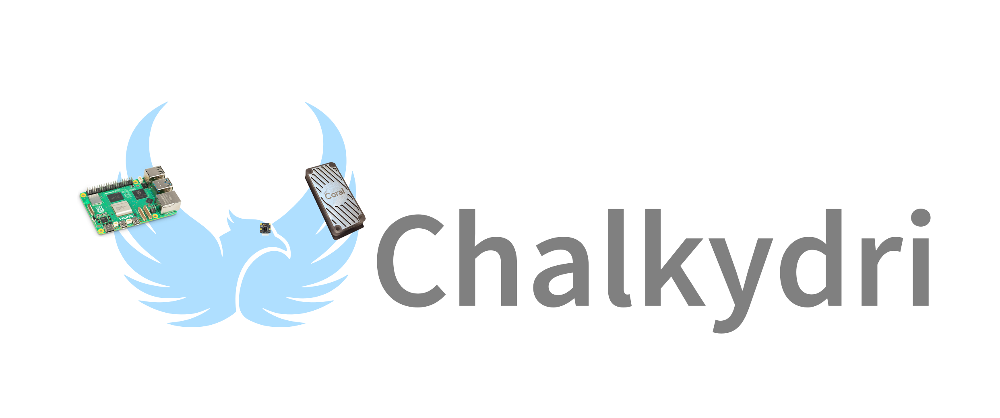

Chalkydri is a *blazingly fast* vision system for FRC written in Rust.

 > **In development**
 >
 > Chalkydri isn't ready to use quite yet.

 > **New here?**
 >
 > Check out our [Getting Started guide](./getting_started/index.md)!

## About

Chalkydri was created by and is managed by FRC Team 4533 (Phoenix).

We're trying to make vision less of a black box, so *all* FRC teams can use it, no matter their size.
We also want it to be easier to use effectively with less hassle.

Chalkydri has been built from the ground up for performance on popular FRC vision hardware and uses less CPU and memory than existing solutions.

## Credits

 - [PhotonVision](https://github.com/PhotonVision/photonvision)
   - Main inspiration for the design of Chalkydri

 - [Lincoln](https://github.com/frc4533-lincoln) (Student, 4533)
   - Phoenix vision code lead

 - [Chloe](https://github.com/chofuu) (Student, 4533)
   - Implemented pose estimation

 - [Eda](https://github.com/) (Student, 4533)
   - Implemented AprilTags edge checking algorithm

 - [Drake](https://github.com/drakeerv) (Student, 4533)
   - Past vision code lead

